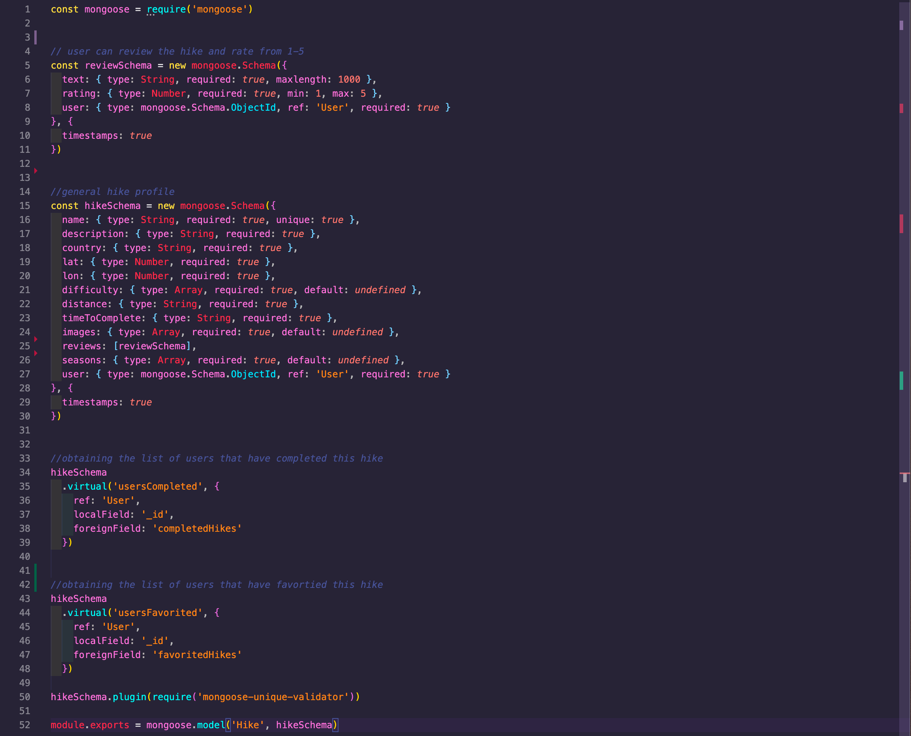

# Project 3 - Hikr

Table of Contents:

- Project Overview
- The Brief
- Technologies USed
- Approach Taken - (screenshots and featured code)
- Wins and Blockers
- Bugs
- Future Content and Improvements
- Original README planning notes

## Overview

Project 3 was my first experience of building a full stack application as part of a group. After a short amount of discussion we came up with the idea of building HIKR, a social app for users to add, share and review their favourite hikes, as well as organise groups with associated activities. 

## You will find the completed project here: https://hikrrr.herokuapp.com/

Please feel free to log in using the following credentials:

email: andy@email\
password: pass

## The Brief

* **Build a full-stack application** by making your own back-end and your own front-end
* **Use an Express API** to serve your data from a Mongo database
* **Consume your API with a separate front-end** built with React
* **Be a complete product** which most likely means multiple relationships and CRUD functionality for at least a couple of models
* **Implement thoughtful user stories/wireframes** that are significant enough to help you know which features are core MVP and which you can cut
* **Be deployed online** so it's publicly accessible.

--- 
## Technologies Used

### Back-end:
- Node.js
- Mongodb
- Express
- Bcrypt
- Body-parser
- Mongoose
- jsonwebtoken

### Frontend:
- React
- Axios
- Bulma
- SCSS
- Http-proxy-middleware
- Nodemon
- React Router Dom
- React Mapbox GL
- React Responsive Carousel
- React Calendar
- React Moment
- React rating stars component
- React select

### Development tools:
- VS code
- NPM 
- Insomnia
- Git
- Github
- Google Chrome dev tools
- Heroku (deployment)
- Trello Board (planning and timeline)
- Miro Board (wireframing)

---

## Approach taken

## Day 1 - Planning
The first step after deciding the nature of the app and getting our initial ideas down on paper, was to work on the routes, models and controllers we would need to make sure the app functions how we planned (you can see the original planning for this at the bottom of this README). We had settled on three models in total - The User, The Hike, and the Group. After this we created a basic wireframe for the look of each page and also how users may flow through the app. 

After this we put together a plan as to how we would divide the work between the three of us, using Trello to keep on top of things throughout the project. Beacuse we all wanted to have a hand in creating both back-end and frontend, we decided that it was logical and a good idea to take on building the model schema's, routes, and controllers split with one each. This would then lead us onto building the frontend in the same way. Purvi took on the User's, Kuriko took on the Groups, and I was challenged with building the Hikes.  

## Back-end - Day 2 & 3

The Hike model was created using Mongoose and ended up being less complicated than originally planned. Initally I had planned on having the main hike schema along with 3 embedded schemas (image upload, review, and rating) and two virtual schemas linked with the User Schema (user favorites, and user completed). Eventually the embedded schema's were whittled down to just the one that would take care of the reviews and ratings together and the images updloaded into the main schema's array. 

For the Hike model I created the controllers for all CRUD actions as well as image upload and create and delete reviews. These were tested with Insomnia to make sure the back-end was receiving the correct authorisations and sending the correct responses with exactly the right amount of info to build the front end. 

As a team, we were able to build our back-ends at a similar pace helping each other as we went, which meant we could all then spend a good amount of time on day 3 testing and making sure the embedded and virtual schema's were populated with the correct information. 

---
## Front-end - Day 4, 5, 6, 7 & 8

For the front-end we initially pair coded to get the React installed with the dependencies we would all initially require to get going on our own sections. We continued with the same sections as before, so I was in charge of the HikesIndex, HikeShow, HikeCreate and HikeUpdate pages. 

For testing we used HTTP-proxy-middleware to link the back-end with the front-end. This enabled us to work on both parts and to quickly make and see changes without having to go through the build process each time. We also used Nodemon for hot-reloading of the browser which again increased our efficiency while building out the front-end

Our plan with the front-end was to hit MVP stage by the end of day 5. For the API requests we used AXIOS and built a separate library of all the request functions that were then imported into each page.

We decided to use Bulma for the styling throughout. With this in mind, we wanted to try and build out each component with using the Bulma framework where possible, to make less work towards the end of the build on general styling so we would have more time to either add more features or neaten up styling and seed more data. 

I built the front-end in class based React. For each section, it was a case of first making sure everything is hooked up and getting/showing the data in the console before then adding the components to show it. 

### **HikesIndex**

For the Hike index page I wanted the user to have the choice of three views - Card, List and Map view. Initially for MVP I had decided on just adding the List and Map views. It was important that if the user had searched for a particular hike or location that if they switched views then this filter would still be there. This was very simply achieved by having the three views either showing or hidden depending on what the user had chosen. 

### handleViewChange - screenshot:

As for the Map view - I decided to use React-Mapbox-GL. I am very happy with the final result of this. It works well on both desktop and Mobile however, I had one bug that I was unable to fix and is on my list of improvements for V2 of the app. When the user would click on a pin to expand to the larger info pin it would not always be at the front of the page and would often be overlapped by the smaller pins around it due to the order that the page renders the array of Hikes. To solve this I would add a function that when a user clicked on the smaller pin, it would remove the clicked hike from the array and pop it back on to the end therefore bringing it to the front of the list. 

### Map view - screenshot:

MVP for HikesIndex was hit on day 4 and on day 6 I added the card view which was a simple addition using the Bulma framework.

---

### **HikeShow**

For HikeShow there was a lot more complexity to add to the page. Features for the page included the user having the ability to update the hike(if they were the owner/creator), add/delete a review and rating, add Images to the gallery and add/remove the hike to their favorites. Therefore there was a lot of pre planning to decide the MVP requirements and what was nice to have. I decided that the adding favorites, and adding images would be a nice to have feature and to focus on the reviews and rating to make sure that they worked well. On day 7 I used the react-rating-stars component to add a nice hover-over and selection of the rating instead of the radio selection that worked for MVP

MVP for this page was hit by the end of day 5, so on day 6 I spent time adding the image gallery with react-responsive-carousel component, and the location section with react-mapbox-GL again. 

Another feature added was the 'Add Favourite' button. For this button to work well - I had to add in a check to see if the currently viewed hike was already in the users favorites list. If so then I would show the 'Remove Favourite' button and if not then the 'Add Favourite' button was displayed. Again, a simple feature that added a realworld touch to this feature

---
### Add/remove favorites code snippet - screenshot: 

---

### **HikeCreate / HikeUpdate forms**

The HikeCreate and HikeUpdate forms were created using the same HikeForm component. With the HikeUpdate feature I just had to prepopulate the form with the correct data. For the selection boxes such as Difficulty and Seasons I decided to use the react-select package to add in a slick selection process. 

---
## Day 8 & 9 -  Styling tweaks & SEED CITY!

Day 8 & 9 was mostly spent styling and adding the correct fonts to buttons and titles etc. Myself and Purvi were working closely to make sure that the form pages, index pages and show pages were inline with each other and branded in uniform. We also spent a good amount of time building up the seeds database for the hikes - taking a few countries each and adding 5-10 hikes for the area. We originally thought we may be able to use an external API to get the data for this but upon searching we found it hard to find one with the info we required. 

---
## Deployment

The app was then deployed through Heroku. Initially we linked up the front-end to the back-end and tested locally, and once we were happy with this then hit the deploy button on Heroku through the CLI. Once the app was then deployed online we seeded in the relevent data.

---
# Final Product

### Home Page:

---

### HikesIndex page:

---
### HikeShow page:

---
### HikeCreate page:

---
### Profile page:

---
### Groups page:

---

# Wins and Blockers

### **Wins:**
A big win for me personally was that we created a very slick website which has responsive design. I managed to add all of the features we had originally planned for the Hikes section of the site. I believe this is because I managed to stick to the schedule well and achieve the smaller targets set out for each day. 

I personally continued to use Trello to keep on top of my to-do list and this worked very well throughout the project. 

### **Blockers:**
One of the main blockers for this project was the mapbox-GL popups in that they would not show in front of all other pins once selected. I tried multiple options to get this working on day 8 including -  adding a new class to the selected pin which would increase the z-index however, this didn't work because of the positioning of the elements. I also tried using :before and :after in CSS but again, this failed to work. Unfortunately it was too late in the day to get this working correctly and I have had the idea for V2 of the app to try to slice the selected hike from the array and pop it back onto the end thus causing a re-render of the page but with the hike at the front as it will be last in the list...

another blocker, and this is more of a general blocker than a code blocker, would be the sometimes lacking in communication between team members. Due to one of the team being located in a completely different time-zone, it was often hard to keep track of where we were all at and if there were any problems occuring. For example, on day 8 which we had put aside for cleaning up and styling - the Groups section was having issues that myeslf and Purvi, weren't aware of because of this lack of communication. I believe communication between team members is a crucial aspect of programming during a project, especially in this early stage of our programming careers. 

If we had clearer communiction we would have been able to help reign in the amount of features being added to the groups section, help with fixing bugs and make sure that upon deployment we were all together finished as a team. 

# Bugs
- Updating a hike works except for the adding the images isnt pre-populated
- Error handling on forms
- HikeIndex map view isnt showing the large popup correctly above the others on the page
- When searching on the home page this is not pre populated on the index page (it errors if it is populated)
- Not so much a bug, but I am not so happy with the styling of the Groups section

# Future Content and Improvements
- Finish the styling in Groups section
- I would like the hikes to have more details about the specific route - but this will take a lot of research! GPS co-ordinates etc
- More interactive map feature on both the hike index and hike show pages
- better error handling and error page

---
---
---

# Original planning notes below:

## sei-group-project-3
Main repo for SEI Group Project 3

Responsibilities:\
Andy Bradshaw - Hikes\
Purvi Trivedi - Login, Register, Hikr Profiles\
Kuriko IWAI - Groups

## Name: Hikr

## Back-end:

### Database

- Users
- Groups
- Hikes

### Third party Info
- Fake users ? faker? 
- Hikes ? 

### Models
User
- username
- email
- password
- profile image
- biography
- completed hikes - embedded
- favourited hikes - embedded
(group members, user added images, user created hike)

Group
- group name
- group members - referenced (to user)
- events/meetups - form (add new event - date, time, selection of hikes) - referenced
- imageHeader - 
- user added images - embedded
- group messages - embedded

Hike
- name
- location (lat/long)
- country
- description
- distance
- difficulty rating - 
- time to complete
- images 
- user added images - referenced (to user)
- comments - embedded
- stars out of 5 - embedded
- approprite seasons
- user created hike - referenced (to user)

### Controllers

User 
- Create user
- Read SingleUser
- Update
- Delete

Groups
- Create Group
- Read
- Update
- Delete
- comment/messages
- add new event

Hikes
- Create 
- Find by Id
- Update
- Delete
- Comment
- Add Favourite
- Add image

### Routes

/hikes - index page GET/POST
/hikes/:id - hike show page GET/PUT/DELETE
/hikes/:id/comments - hike comments page POST
/hikes/:id/comments/:id - delete comment DELETE/PUT

/register - POST
/login - POST

/groups groups index page GET/POST
/groups/:id group profile page GET/PUT/DELETE
/groups/:id/messages - groups messages page POST
/groups/:id/messages/:id - delete/edit messages DELETE/PUT
/groups/:id/events index and create events GET/POST    
/groups/:id/events/:id GET/PUT/DELETE

/profiles  idex of users GET
/profiles/:username users profile pages GET/POST/PUT/DELETE
